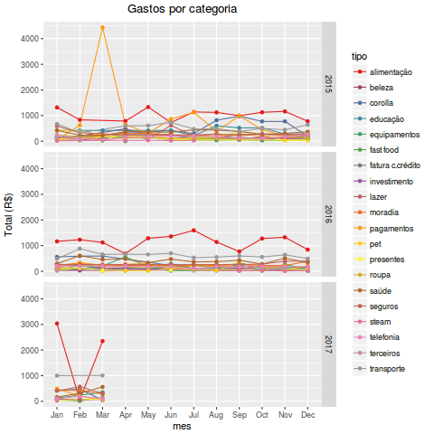
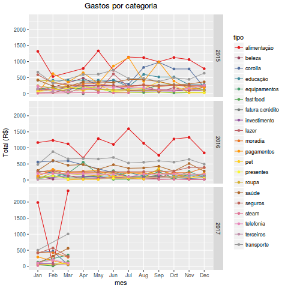
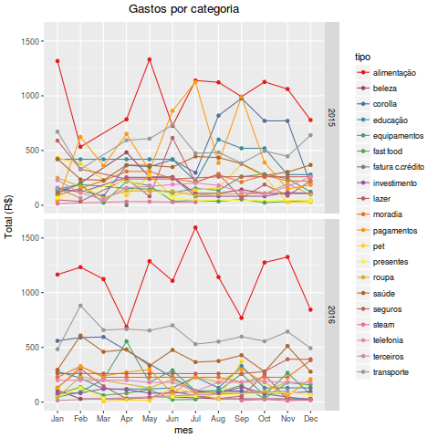
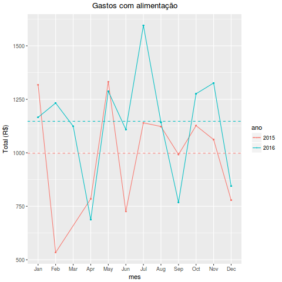
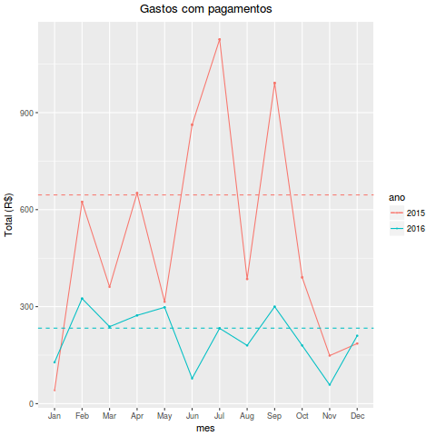
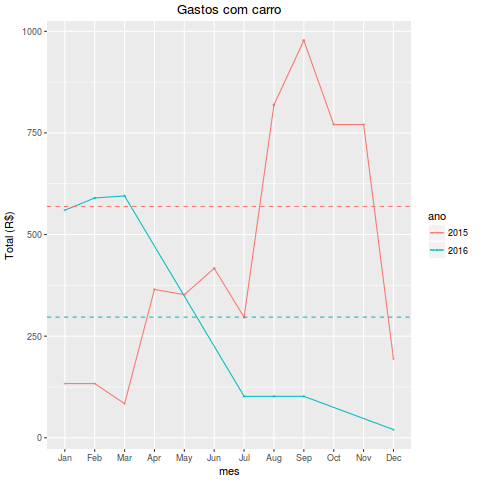

# Readme

Análise de uma planilha de gastos, separados em 20 categorias, de 10/14 a 03/17.

## O que este script faz: prepareDF.R

- carrega o bd, neste caso, versão excel
- faz o tratamento dos dados
- grava o db para o disco - dadosM.csv
- agrupa os dados por categoria (tipos de gastos) e faz um sumário calculando os totais
- cria uma paleta de cores brewer para 20 categorias
- plota os totais por categoria, um painel para cada ano
- após o refinamento dos dados, através da análise dos plots 1 a 3, grava o db para o disco - totais.rds e dados-fitlrados.rds
- faz a análise exploratória
- trata os dados de acordo com as necessidades apontadas na análise

## O que este script faz: analiseFin.R

- plota gráficos para a análise financeira

## Como são tratados os dados:

- removendo NA, que neste caso só corresponde às linhas que não possuem data, são apenas 
formatação do excel: complete.cases()
- renomeando algumas variáveis, formatando seus nomes e seu conteúdo para lower case, para facilitar o uso das vars
- acertando formatos de data e descrição, pacote lubridate
- adicionando as cols mes e ano, para facilitar o plot por painéis
- filtrando as informações que interessam, ou seja, somente da conta itau
- datas acima de 01-01-15, vamos considerar que eu não usava bem o app antes disso
- datas abaixo de 25-03-2017, quando o arquivo foi gerado (pq o db tem dados de 
"previsão de gastos" até o fim do ano
- removendo as colunas indesejadas
- os dados são tratados novamente conforme o andamento da análise exploratória

## Análise exploratória para tratamento dos dados

### Gráfico 1

Analisando o primeiro plot, vemos que há problemas em mar-2015, pagamentos, e em jan/mar-2017 alimentação: pontos fora do gráfico

olhamos mais de perto para estes dados e verificamos que os valores de previsão não foram retirados após o final de alguns meses, portanto podemos tirar estes pontos do gráfico. Além disso, consta um lançamento referente a pagamento de cc, mas não é assim que eu uso o programa.

Assim, filtrar os dados novamente para retirar todas as lihas onde descrição contenha "previsão" ou "visa", usando grep.

Agora podemos gerar o plot 2

### Gráfico 2

Analisando o 2nd gráfico, vemos que ainda há problemas com os lançamentos de 2017: valores altos de alimentação para jan e mar, 0 em fev.

Vou ter que verificar os dados no servidor, para exportar novamente o db e recomeçar.

Por hora, vamos apenas remover 2017 e fazer o plot 3

### Gráfico 3

Como podemos ver no gráfico 3, não há mais pontos obviamente fora do gráfico, todos os erros de coleta dados. de  vamos gravar os dados em totais.csv e dados-filtrados.csv.

O próximo passo é estudar as categorias que mais se destacam: alimentação, pagamentos e corolla, fazendo subset para cada categoria

## Análise exploratória - Finanças

### Alimentação

Observa-se:

- tendência a aumento de gastos em maio. Fazendo um subset dos dados, verifica-se que isso ocorre porque as compras para a páscoa são pagas em maio, cc
- portanto, vigiar o cartão em abril
- tendência a aumento de gastos em julho. Fazendo um subset dos dados, verifica-se que isso ocorreu em 2016 porque foram feitas 2 compras no mes, para aproveitar uma promoção. Vê-se que este gasto despenca até setembro, voltando a subir em agosto, próx compra
- sobe e desce: as compras maiores não são feitas todo mes

### Pagamentos

Observa-se:

- aumento bizarro em 2015 de fev a set. Fazendo um subset, verifica-se que isso ocorreu porque a cada vez que as metas de economia não eram alcançadas, o valor gasto a mais era lançado no mês seguinte como déficit, atingindo o pico em agosto. 
- Por outro lado, verifica-se que nunca mais houve deficit. 
- Em setembro de 2015 abrimos a loja de roupas da aline, o valor investido foi parcelado e lançado nesta categoria.

### Corolla

Observa-se:

- valores altos de agosto a nov de 2015: Fazendo um subset, verifica-se que isso ocorreu porque em agosto foi renovado o seguro, em 4x, isso explica as altas até nov;
- e em setembro foi feita uma manutenção de 10k, também parcelada em 4x
- queda a partir de jul-16: venda do carro em julho

# Conclusão

Entre 2015 e 2016, verificamos que:

- os valores mais altos estão em alimentação, pagamentos e corolla
- deve-se tomar cuidado com os gastos para a páscoa
- havia um déficit em 2015, mas foi superado
- o seguro do carro era uma pancada, e as manutenções mantinham as médias de gasto mensal na casa dos R$500, mas esse problema acabou com a venda do carro.
