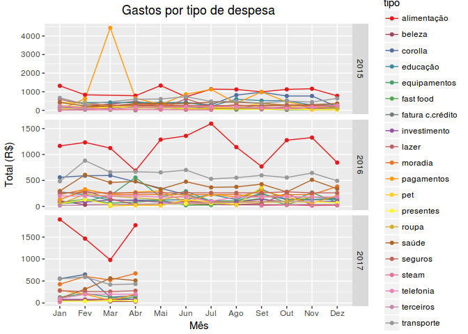

WIP - Plataforma Mobills - análise de despesas pessoais
=======================================================

*erickfis, 2017 maio, 03*

Análise da plataforma **mobils**, um app android que registra despesas
realizadas, armazena os dados na nuvem e permite a posterior exportação
destes dados.

# Sumário

-   [Objetivo](#objetivo)
-   [A plataforma Mobills](#a-plataforma-mobills)
-   [Processamento dos dados](#processamento-dos-dados)
    -   [Tratamento inicial dos dados](#tratamento-inicial-dos-dados)
    -   [Análise da qualidade dos
        dados](#analise-da-qualidade-dos-dados)
-   [Principais tipos de despesas](#principais-tipos-de-despesas)
    -   [Análise por tipo de despesa:
        Alimentação](#analise-por-tipo-de-despesa-alimentacao)
    -   [Análise por tipo de despesa:
        Pagamentos](#analise-por-tipo-de-despesa-pagamentos)
    -   [Análise por tipo de despesa:
        Corolla](#analise-por-tipo-de-despesa-corolla)
-   [Conclusão](#conclusao)

Objetivo
========

Analisar uma planilha de gastos domésticos registrados ao longo dos
meses e verificar a existência de tendências relacionadas à estações do
ano, datas comemorativas ou datas-chave.

Os dados foram gerados pela plataforma mobils, um app android que
registra despesas realizadas, armazena os dados na nuvem e permite a
posterior exportação destes dados.

<https://web.mobills.com.br>

A plataforma Mobills
====================

-   necessário escolher a conta ao exportar o csv

Processamento dos dados
=======================

Este código carrega e prepara o banco de dados para que possamos
responder às questões levantadas.

Tratamento inicial dos dados
----------------------------

Antes de procurar estabelecer qualquer correlação, vamos primeiramente
analisar os dados exportados pela plataforma, procurando avaliar sua
qualidade e quais são as transformações necessárias para o seu uso.

<!-- tratar inicial.csv com sed+grep para filtrar 2015 e 2016 -->
<!-- Pega a 1a linha, para cabeçalho -->
<!-- $ sed -n "1,5p" inicial.csv > newData.csv -->
<!-- filtra 2015 e 2016 -->
<!-- $ grep -E "^(,2015|,2016)" inicial.csv >> newData.csv -->
Análise da qualidade dos dados
------------------------------

Analisando o primeiro gráfico, vemos que há problemas em março de 2015,
tipo pagamentos.

Vamos olhar este ponto fora do gráfico mais de perto:

<table>
<thead>
<tr class="header">
<th align="left">data</th>
<th align="left">ano</th>
<th align="left">mes</th>
<th align="left">tipo</th>
<th align="left">descrição</th>
<th align="right">valor</th>
</tr>
</thead>
<tbody>
<tr class="odd">
<td align="left">2015-03-25</td>
<td align="left">2015</td>
<td align="left">Mar</td>
<td align="left">pagamentos</td>
<td align="left">pagamento parcial-visa</td>
<td align="right">4077</td>
</tr>
<tr class="even">
<td align="left">2015-03-10</td>
<td align="left">2015</td>
<td align="left">Mar</td>
<td align="left">pagamentos</td>
<td align="left">banco</td>
<td align="right">41</td>
</tr>
<tr class="odd">
<td align="left">2015-03-10</td>
<td align="left">2015</td>
<td align="left">Mar</td>
<td align="left">pagamentos</td>
<td align="left">saque</td>
<td align="right">90</td>
</tr>
<tr class="even">
<td align="left">2015-03-07</td>
<td align="left">2015</td>
<td align="left">Mar</td>
<td align="left">pagamentos</td>
<td align="left">saque</td>
<td align="right">230</td>
</tr>
</tbody>
</table>

Da tabela acima, podemos observar que consta um lançamento referente a
pagamento de cartão de crédito, mas não é assim que o restante dos
lançamentos foram feitos: não foram registrados totais. Este, portanto,
foi um erro de uso da plataforma. Vamos, portanto, retirar este ponto da
análise.

Além disso, verifica-se que todas as despesas pagas no cartão de crédito
ficaram registradas na data de vencimento do cartão, dia 25.

<table>
<thead>
<tr class="header">
<th align="left">data</th>
<th align="left">ano</th>
<th align="left">mes</th>
<th align="left">tipo</th>
<th align="left">descrição</th>
<th align="right">valor</th>
</tr>
</thead>
<tbody>
<tr class="odd">
<td align="left">2016-07-25</td>
<td align="left">2016</td>
<td align="left">Jul</td>
<td align="left">corolla</td>
<td align="left">webmotors (1/3)</td>
<td align="right">49.97</td>
</tr>
<tr class="even">
<td align="left">2016-07-25</td>
<td align="left">2016</td>
<td align="left">Jul</td>
<td align="left">saúde</td>
<td align="left">coop capuava (2/3)</td>
<td align="right">53.76</td>
</tr>
<tr class="odd">
<td align="left">2016-07-25</td>
<td align="left">2016</td>
<td align="left">Jul</td>
<td align="left">transporte</td>
<td align="left">auto posto miro</td>
<td align="right">30.00</td>
</tr>
<tr class="even">
<td align="left">2016-07-25</td>
<td align="left">2016</td>
<td align="left">Jul</td>
<td align="left">corolla</td>
<td align="left">mercadopago (1/3)</td>
<td align="right">52.04</td>
</tr>
<tr class="odd">
<td align="left">2016-07-25</td>
<td align="left">2016</td>
<td align="left">Jul</td>
<td align="left">alimentação</td>
<td align="left">coop capuava</td>
<td align="right">15.25</td>
</tr>
<tr class="even">
<td align="left">2016-07-25</td>
<td align="left">2016</td>
<td align="left">Jul</td>
<td align="left">alimentação</td>
<td align="left">compras pão de açúcar</td>
<td align="right">475.00</td>
</tr>
</tbody>
</table>

<table>
<thead>
<tr class="header">
<th align="left">data</th>
<th align="left">ano</th>
<th align="left">mes</th>
<th align="left">tipo</th>
<th align="left">descrição</th>
<th align="right">valor</th>
</tr>
</thead>
<tbody>
<tr class="odd">
<td align="left">2016-07-25</td>
<td align="left">2016</td>
<td align="left">Jul</td>
<td align="left">alimentação</td>
<td align="left">pao do marques</td>
<td align="right">10.34</td>
</tr>
<tr class="even">
<td align="left">2016-07-25</td>
<td align="left">2016</td>
<td align="left">Jul</td>
<td align="left">investimento</td>
<td align="left">uber*uber</td>
<td align="right">7.39</td>
</tr>
<tr class="odd">
<td align="left">2016-07-25</td>
<td align="left">2016</td>
<td align="left">Jul</td>
<td align="left">alimentação</td>
<td align="left">sacolao saude st</td>
<td align="right">88.82</td>
</tr>
<tr class="even">
<td align="left">2016-07-25</td>
<td align="left">2016</td>
<td align="left">Jul</td>
<td align="left">lazer</td>
<td align="left">bruti s cafe e lanches</td>
<td align="right">12.50</td>
</tr>
<tr class="odd">
<td align="left">2016-07-25</td>
<td align="left">2016</td>
<td align="left">Jul</td>
<td align="left">alimentação</td>
<td align="left">assai atacadista</td>
<td align="right">482.89</td>
</tr>
<tr class="even">
<td align="left">2016-07-25</td>
<td align="left">2016</td>
<td align="left">Jul</td>
<td align="left">fast food</td>
<td align="left">divino fogao c t da fa</td>
<td align="right">19.83</td>
</tr>
</tbody>
</table>

Desta forma, não é possível dizer se a despesa foi feita no mês anterior
ou no próprio mês. Ela apenas foi paga no mês onde é lançada. Uma vez
que a fatura deste cartão é fechada no dia 15, todas as compras
realizadas a partir do dia 16 são cobradas apenas na próxima fatura.

No entanto, como isso ocorre para todos os dados da mesma forma, não há
impacto impeditivo na análise.

Como podemos ver no gráfico 2, não há mais pontos obviamente fora do
gráfico, todos os erros de coleta dados foram filtrados.

O próximo passo é estudar os tipos de despesas que mais se destacam:
alimentação, pagamentos e corolla.

Principais tipos de despesas
============================

Análise por tipo de despesa: Alimentação
----------------------------------------

Observa-se:

-   tendência a aumento de gastos em maio
-   tendência a aumento de gastos em julho
-   aumento da média em 2016
-   sobe e desce: as compras maiores não são feitas todo mês

Vamos analisar a tabela de dados:

<table>
<thead>
<tr class="header">
<th align="left">data</th>
<th align="left">ano</th>
<th align="left">mes</th>
<th align="left">tipo</th>
<th align="left">descrição</th>
<th align="right">valor</th>
</tr>
</thead>
<tbody>
<tr class="odd">
<td align="left">2015-05-25</td>
<td align="left">2015</td>
<td align="left">Mai</td>
<td align="left">alimentação</td>
<td align="left">18-04 mercado</td>
<td align="right">405.00</td>
</tr>
<tr class="even">
<td align="left">2015-05-25</td>
<td align="left">2015</td>
<td align="left">Mai</td>
<td align="left">alimentação</td>
<td align="left">12-04 feira</td>
<td align="right">130.00</td>
</tr>
<tr class="odd">
<td align="left">2015-05-25</td>
<td align="left">2015</td>
<td align="left">Mai</td>
<td align="left">alimentação</td>
<td align="left">25-04 feira</td>
<td align="right">103.00</td>
</tr>
<tr class="even">
<td align="left">2015-05-25</td>
<td align="left">2015</td>
<td align="left">Mai</td>
<td align="left">alimentação</td>
<td align="left">19-04 feira</td>
<td align="right">90.00</td>
</tr>
<tr class="odd">
<td align="left">2015-05-25</td>
<td align="left">2015</td>
<td align="left">Mai</td>
<td align="left">alimentação</td>
<td align="left">19-04 feira</td>
<td align="right">90.00</td>
</tr>
<tr class="even">
<td align="left">2015-05-25</td>
<td align="left">2015</td>
<td align="left">Mai</td>
<td align="left">alimentação</td>
<td align="left">09-05 feira</td>
<td align="right">89.00</td>
</tr>
<tr class="odd">
<td align="left">2015-05-25</td>
<td align="left">2015</td>
<td align="left">Mai</td>
<td align="left">alimentação</td>
<td align="left">25-04 camarao</td>
<td align="right">88.00</td>
</tr>
<tr class="even">
<td align="left">2015-05-25</td>
<td align="left">2015</td>
<td align="left">Mai</td>
<td align="left">alimentação</td>
<td align="left">02-05 feira</td>
<td align="right">86.00</td>
</tr>
<tr class="odd">
<td align="left">2015-05-25</td>
<td align="left">2015</td>
<td align="left">Mai</td>
<td align="left">alimentação</td>
<td align="left">09-05 mercado</td>
<td align="right">59.00</td>
</tr>
<tr class="even">
<td align="left">2015-07-27</td>
<td align="left">2015</td>
<td align="left">Jul</td>
<td align="left">alimentação</td>
<td align="left">16-06 compras</td>
<td align="right">566.00</td>
</tr>
<tr class="odd">
<td align="left">2015-07-27</td>
<td align="left">2015</td>
<td align="left">Jul</td>
<td align="left">alimentação</td>
<td align="left">04-07 feira</td>
<td align="right">138.00</td>
</tr>
<tr class="even">
<td align="left">2015-07-27</td>
<td align="left">2015</td>
<td align="left">Jul</td>
<td align="left">alimentação</td>
<td align="left">27-06 feira</td>
<td align="right">103.00</td>
</tr>
<tr class="odd">
<td align="left">2015-07-27</td>
<td align="left">2015</td>
<td align="left">Jul</td>
<td align="left">alimentação</td>
<td align="left">29-06 walmart</td>
<td align="right">85.00</td>
</tr>
<tr class="even">
<td align="left">2015-07-27</td>
<td align="left">2015</td>
<td align="left">Jul</td>
<td align="left">alimentação</td>
<td align="left">11-09 feira</td>
<td align="right">76.00</td>
</tr>
<tr class="odd">
<td align="left">2015-07-27</td>
<td align="left">2015</td>
<td align="left">Jul</td>
<td align="left">alimentação</td>
<td align="left">20-06 feira</td>
<td align="right">72.00</td>
</tr>
<tr class="even">
<td align="left">2016-05-25</td>
<td align="left">2016</td>
<td align="left">Mai</td>
<td align="left">alimentação</td>
<td align="left">assai atacadista</td>
<td align="right">430.14</td>
</tr>
<tr class="odd">
<td align="left">2016-05-25</td>
<td align="left">2016</td>
<td align="left">Mai</td>
<td align="left">alimentação</td>
<td align="left">sacolao saude st</td>
<td align="right">108.76</td>
</tr>
<tr class="even">
<td align="left">2016-05-25</td>
<td align="left">2016</td>
<td align="left">Mai</td>
<td align="left">alimentação</td>
<td align="left">sacolao saude st</td>
<td align="right">86.93</td>
</tr>
<tr class="odd">
<td align="left">2016-05-25</td>
<td align="left">2016</td>
<td align="left">Mai</td>
<td align="left">alimentação</td>
<td align="left">sacolao saude st</td>
<td align="right">85.80</td>
</tr>
<tr class="even">
<td align="left">2016-05-25</td>
<td align="left">2016</td>
<td align="left">Mai</td>
<td align="left">alimentação</td>
<td align="left">sacolao saude st</td>
<td align="right">83.42</td>
</tr>
<tr class="odd">
<td align="left">2016-05-25</td>
<td align="left">2016</td>
<td align="left">Mai</td>
<td align="left">alimentação</td>
<td align="left">coop capuava</td>
<td align="right">67.72</td>
</tr>
<tr class="even">
<td align="left">2016-05-25</td>
<td align="left">2016</td>
<td align="left">Mai</td>
<td align="left">alimentação</td>
<td align="left">coop capuava</td>
<td align="right">64.20</td>
</tr>
<tr class="odd">
<td align="left">2016-05-25</td>
<td align="left">2016</td>
<td align="left">Mai</td>
<td align="left">alimentação</td>
<td align="left">coop capuava</td>
<td align="right">60.53</td>
</tr>
<tr class="even">
<td align="left">2016-05-25</td>
<td align="left">2016</td>
<td align="left">Mai</td>
<td align="left">alimentação</td>
<td align="left">carrefour sto 248</td>
<td align="right">50.25</td>
</tr>
<tr class="odd">
<td align="left">2016-07-25</td>
<td align="left">2016</td>
<td align="left">Jul</td>
<td align="left">alimentação</td>
<td align="left">assai atacadista</td>
<td align="right">482.89</td>
</tr>
<tr class="even">
<td align="left">2016-07-25</td>
<td align="left">2016</td>
<td align="left">Jul</td>
<td align="left">alimentação</td>
<td align="left">compras pão de açúcar</td>
<td align="right">475.00</td>
</tr>
<tr class="odd">
<td align="left">2016-07-25</td>
<td align="left">2016</td>
<td align="left">Jul</td>
<td align="left">alimentação</td>
<td align="left">sacolao saude st</td>
<td align="right">117.15</td>
</tr>
<tr class="even">
<td align="left">2016-07-25</td>
<td align="left">2016</td>
<td align="left">Jul</td>
<td align="left">alimentação</td>
<td align="left">sacolao saude st</td>
<td align="right">92.55</td>
</tr>
<tr class="odd">
<td align="left">2016-07-25</td>
<td align="left">2016</td>
<td align="left">Jul</td>
<td align="left">alimentação</td>
<td align="left">sacolao saude st</td>
<td align="right">88.82</td>
</tr>
<tr class="even">
<td align="left">2016-07-25</td>
<td align="left">2016</td>
<td align="left">Jul</td>
<td align="left">alimentação</td>
<td align="left">sacolao saude st</td>
<td align="right">74.67</td>
</tr>
</tbody>
</table>

Da tabela acima, verifica-se que o aumento em maio ocorre porque as
compras para a páscoa são pagas em maio, no cartão de crédito.

Portanto, verifica-se que há tendência para gastos extras com a páscoa.

Além disso, o aumento em julho de 2016 ocorreu porque foram feitas 2
compras mensais, para aproveitar uma promoção. Vê-se que este gasto cai
até setembro, voltando a subir em outubro, próxima compra mensal.

O aumento da média em 2016 ocorre porque, além dos fatores acima, em
março 2015 os gastos não foram registrados.

Análise por tipo de despesa: Pagamentos
---------------------------------------

Observa-se:

-   aumento significativo de de fevereiro a setembro de 2015.

Vamos analisar a tabela de dados, em especial para valores acima de
R$200,00:

<table>
<thead>
<tr class="header">
<th align="left">data</th>
<th align="left">ano</th>
<th align="left">mes</th>
<th align="left">tipo</th>
<th align="left">descrição</th>
<th align="right">valor</th>
</tr>
</thead>
<tbody>
<tr class="odd">
<td align="left">2015-02-26</td>
<td align="left">2015</td>
<td align="left">Fev</td>
<td align="left">pagamentos</td>
<td align="left">25-02 saque</td>
<td align="right">250</td>
</tr>
<tr class="even">
<td align="left">2015-03-07</td>
<td align="left">2015</td>
<td align="left">Mar</td>
<td align="left">pagamentos</td>
<td align="left">saque</td>
<td align="right">230</td>
</tr>
<tr class="odd">
<td align="left">2015-04-01</td>
<td align="left">2015</td>
<td align="left">Abr</td>
<td align="left">pagamentos</td>
<td align="left">defict mes anterior</td>
<td align="right">230</td>
</tr>
<tr class="even">
<td align="left">2015-05-01</td>
<td align="left">2015</td>
<td align="left">Mai</td>
<td align="left">pagamentos</td>
<td align="left">defict mes anterior</td>
<td align="right">230</td>
</tr>
<tr class="odd">
<td align="left">2015-06-01</td>
<td align="left">2015</td>
<td align="left">Jun</td>
<td align="left">pagamentos</td>
<td align="left">deficit mês anterior</td>
<td align="right">470</td>
</tr>
<tr class="even">
<td align="left">2015-07-01</td>
<td align="left">2015</td>
<td align="left">Jul</td>
<td align="left">pagamentos</td>
<td align="left">defict mes anterior</td>
<td align="right">766</td>
</tr>
<tr class="odd">
<td align="left">2015-08-03</td>
<td align="left">2015</td>
<td align="left">Ago</td>
<td align="left">pagamentos</td>
<td align="left">deficit mês anterior</td>
<td align="right">250</td>
</tr>
<tr class="even">
<td align="left">2015-09-01</td>
<td align="left">2015</td>
<td align="left">Set</td>
<td align="left">pagamentos</td>
<td align="left">deficit mês anterior</td>
<td align="right">490</td>
</tr>
</tbody>
</table>

Verifica-se que este aumento ocorreu porque a cada vez que as metas de
economia não eram alcançadas, o valor gasto acima da meta era lançado no
mês seguinte como déficit, atingindo o pico em agosto.

Por outro lado, verifica-se que nunca mais houve deficit.

Análise por tipo de despesa: Corolla
------------------------------------

Observa-se:

-   valores altos de agosto a novembro de 2015
-   queda a partir de jul-16

Vamos analisar a tabela de dados:

<table>
<thead>
<tr class="header">
<th align="left">data</th>
<th align="left">ano</th>
<th align="left">mes</th>
<th align="left">tipo</th>
<th align="left">descrição</th>
<th align="right">valor</th>
</tr>
</thead>
<tbody>
<tr class="odd">
<td align="left">2015-08-23</td>
<td align="left">2015</td>
<td align="left">Ago</td>
<td align="left">corolla</td>
<td align="left">seguro corolla (1/4)</td>
<td align="right">577.00</td>
</tr>
<tr class="even">
<td align="left">2015-08-25</td>
<td align="left">2015</td>
<td align="left">Ago</td>
<td align="left">corolla</td>
<td align="left">suspensão corolla (2/3)</td>
<td align="right">166.66</td>
</tr>
<tr class="odd">
<td align="left">2015-08-25</td>
<td align="left">2015</td>
<td align="left">Ago</td>
<td align="left">corolla</td>
<td align="left">02-04 bateria (5/5)</td>
<td align="right">65.00</td>
</tr>
<tr class="even">
<td align="left">2015-08-19</td>
<td align="left">2015</td>
<td align="left">Ago</td>
<td align="left">corolla</td>
<td align="left">ducha</td>
<td align="right">10.50</td>
</tr>
<tr class="odd">
<td align="left">2015-09-23</td>
<td align="left">2015</td>
<td align="left">Set</td>
<td align="left">corolla</td>
<td align="left">seguro corolla (2/4)</td>
<td align="right">577.00</td>
</tr>
<tr class="even">
<td align="left">2015-09-25</td>
<td align="left">2015</td>
<td align="left">Set</td>
<td align="left">corolla</td>
<td align="left">manutenção corolla 190k (1/4)</td>
<td align="right">193.75</td>
</tr>
<tr class="odd">
<td align="left">2015-09-25</td>
<td align="left">2015</td>
<td align="left">Set</td>
<td align="left">corolla</td>
<td align="left">suspensão corolla (3/3)</td>
<td align="right">166.66</td>
</tr>
<tr class="even">
<td align="left">2015-09-01</td>
<td align="left">2015</td>
<td align="left">Set</td>
<td align="left">corolla</td>
<td align="left">lavagem carro</td>
<td align="right">30.00</td>
</tr>
<tr class="odd">
<td align="left">2015-09-23</td>
<td align="left">2015</td>
<td align="left">Set</td>
<td align="left">corolla</td>
<td align="left">lavagem carro</td>
<td align="right">10.00</td>
</tr>
<tr class="even">
<td align="left">2015-10-23</td>
<td align="left">2015</td>
<td align="left">Out</td>
<td align="left">corolla</td>
<td align="left">seguro corolla (3/4)</td>
<td align="right">577.00</td>
</tr>
<tr class="odd">
<td align="left">2015-10-25</td>
<td align="left">2015</td>
<td align="left">Out</td>
<td align="left">corolla</td>
<td align="left">manutenção corolla 190k (2/4)</td>
<td align="right">193.75</td>
</tr>
<tr class="even">
<td align="left">2015-11-23</td>
<td align="left">2015</td>
<td align="left">Nov</td>
<td align="left">corolla</td>
<td align="left">seguro corolla (4/4)</td>
<td align="right">577.00</td>
</tr>
<tr class="odd">
<td align="left">2015-11-25</td>
<td align="left">2015</td>
<td align="left">Nov</td>
<td align="left">corolla</td>
<td align="left">manutenção corolla 190k (3/4)</td>
<td align="right">193.75</td>
</tr>
<tr class="even">
<td align="left">2015-12-28</td>
<td align="left">2015</td>
<td align="left">Dez</td>
<td align="left">corolla</td>
<td align="left">manutenção corolla 190k (4/4)</td>
<td align="right">193.75</td>
</tr>
</tbody>
</table>

Verifica-se que isso ocorreu porque em agosto de 2015 foi renovado o
seguro, em 4x, isso explica as altas até novembro; em setembro foi feita
uma manutenção de 10k, também parcelada em 4x.

Por outro lado, a queda a partir de julho de 2016 é explicada pela venda
do carro neste mesmo mês.

Conclusão
=========

Entre 2015 e 2016, verificamos que:

        - os valores mais altos estão em alimentação, pagamentos e corolla

-   deve-se tomar cuidado com os gastos para a páscoa
-   havia um déficit em 2015, mas foi superado
-   o seguro do carro tinha um valor elevado e as manutenções mantinham
    as médias de gasto mensal na casa dos R$500, mas esse problema
    acabou com a venda do carro.
