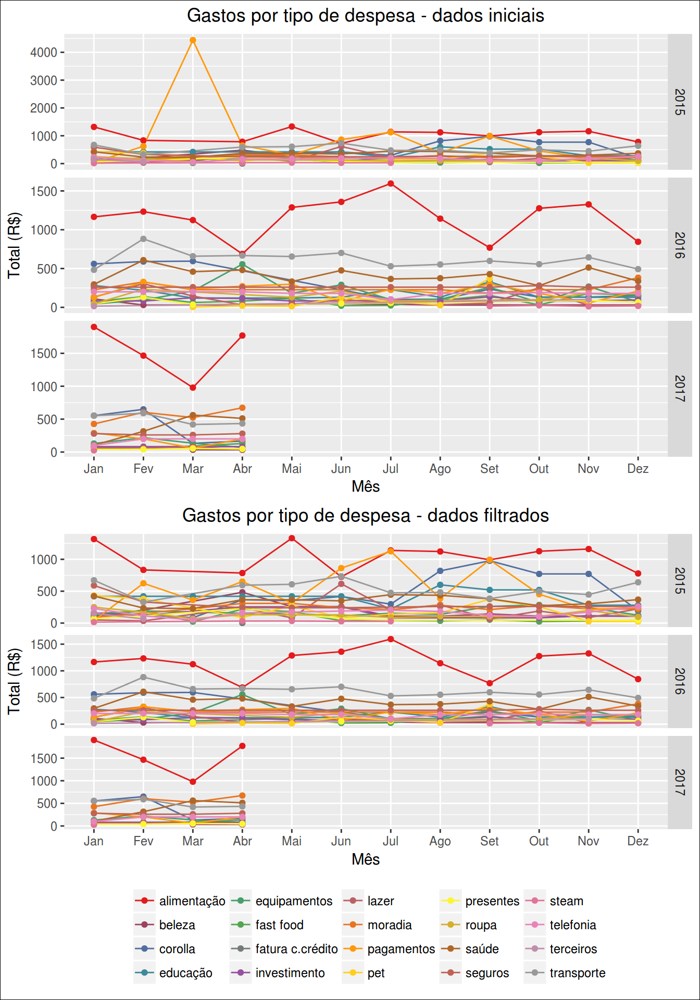
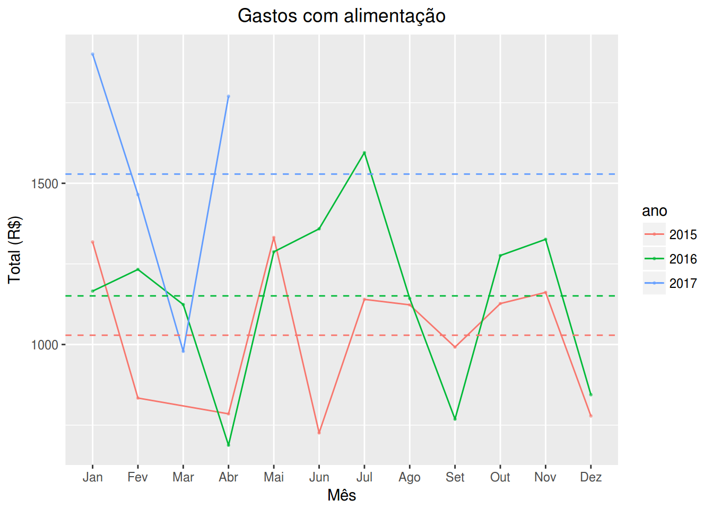
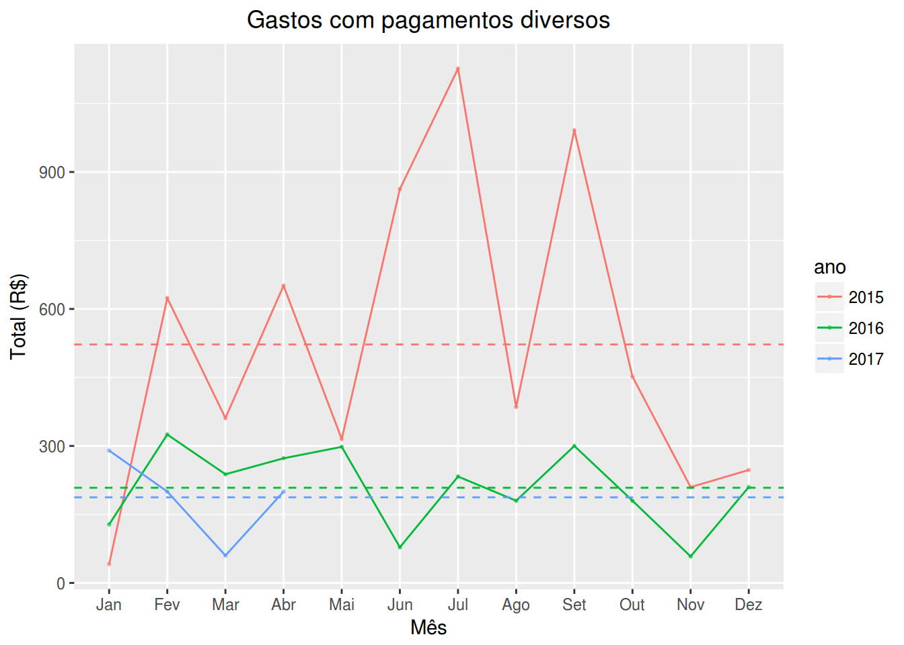
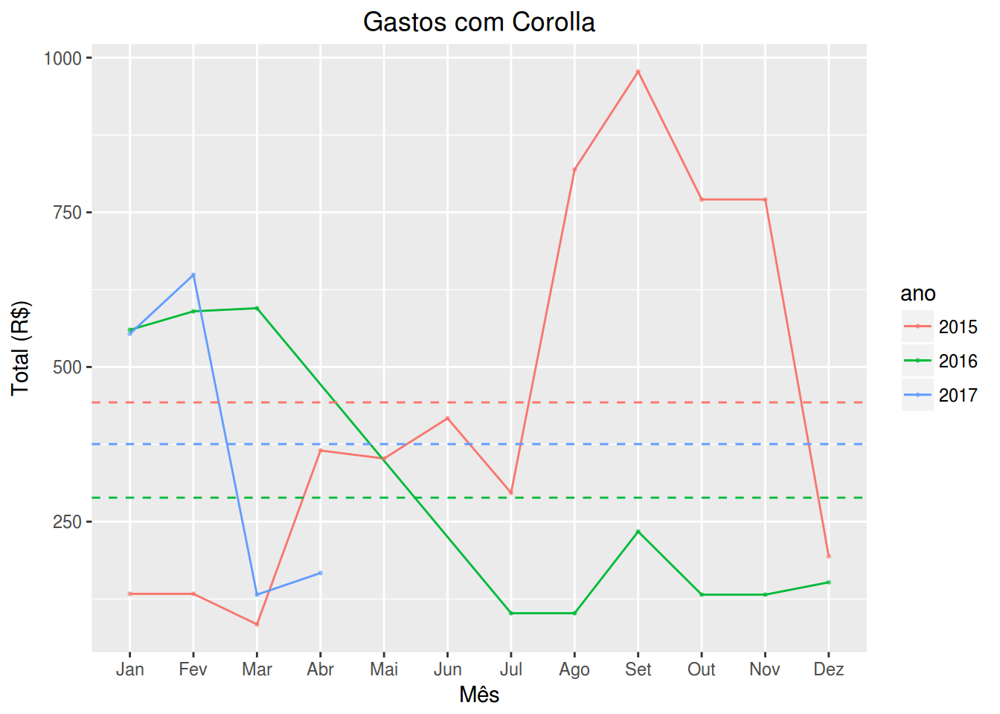

# Plataforma Mobills - Análise de Despesas Pessoais - WIP
erickfis@gmail.com  
`r format(Sys.time(), '%Y %B, %d')`  

# Objetivo

Analisar uma planilha de gastos domésticos registrados ao longo dos meses e verificar a existência de tendências relacionadas à estações do ano, datas comemorativas ou datas-chave.

Os dados foram gerados pela plataforma mobils, um app android que registra despesas realizadas, armazena os dados na nuvem e permite a posterior exportação destes dados.

https://web.mobills.com.br

# A plataforma Mobills

- necessário escolher a conta ao exportar o csv

# Processamento dos dados 

O banco de dados é carregado e preparado para que possamos responder às questões levantadas. 

## Tratamento inicial dos dados

Antes de fazer qualquer inferência, vamos primeiramente analisar os dados exportados pela plataforma, procurando avaliar sua qualidade e quais são as transformações necessárias para o seu uso.

<!-- tratar inicial.csv com sed+grep para filtrar 2015 e 2016 -->
<!-- Pega a 1a linha (1 a 5), para cabeçalho -->
<!-- $ sed -n "1,5p" inicial.csv > newData.csv -->

<!-- filtra 2015 e 2016 -->
<!-- $ grep -E "^(,2015|,2016)" inicial.csv >> newData.csv -->

Transformações necessárias:

- as datas estão em formato char, então são convertidas através do lubridate
- criadas as variáveis mês e ano, para agrupar os dados
- valores estão em formato char, com $ e vírgula
- calculadas as somas por categoria para cada mês e ano

## Análise da qualidade dos dados

Analisando o primeiro gráfico, vemos que há problemas em março de 2015, tipo pagamentos. 

Vamos olhar este ponto fora do gráfico mais de perto:

Table: categoria pagamentos, em março de 2015

data         ano    mes   tipo         descrição                 valor
-----------  -----  ----  -----------  -----------------------  ------
2015-03-25   2015   Mar   pagamentos   pagamento parcial-visa     4077
2015-03-10   2015   Mar   pagamentos   banco                        41
2015-03-10   2015   Mar   pagamentos   saque                        90
2015-03-07   2015   Mar   pagamentos   saque                       230

Da tabela acima, podemos observar que consta um lançamento referente a pagamento de cartão de crédito, mas não é assim que o restante dos lançamentos foram feitos: não foram registrados totais. Este, portanto, foi um erro de uso da plataforma. Vamos, portanto, retirar este ponto da análise.

Table: compras no crédito, registradas no dia 25

data         ano    mes   tipo          descrição                 valor
-----------  -----  ----  ------------  ----------------------  -------
2016-07-25   2016   Jul   corolla       webmotors (1/3)           49.97
2016-07-25   2016   Jul   saúde         coop capuava (2/3)        53.76
2016-07-25   2016   Jul   transporte    auto posto miro           30.00
2016-07-25   2016   Jul   corolla       mercadopago (1/3)         52.04
2016-07-25   2016   Jul   alimentação   coop capuava              15.25
2016-07-25   2016   Jul   alimentação   compras pão de açúcar    475.00

Table: compras no crédito, registradas no dia 25

data         ano    mes   tipo           descrição                  valor
-----------  -----  ----  -------------  -----------------------  -------
2016-07-25   2016   Jul   alimentação    pao do marques             10.34
2016-07-25   2016   Jul   investimento   uber*uber                   7.39
2016-07-25   2016   Jul   alimentação    sacolao saude st           88.82
2016-07-25   2016   Jul   lazer          bruti s cafe e lanches     12.50
2016-07-25   2016   Jul   alimentação    assai atacadista          482.89
2016-07-25   2016   Jul   fast food      divino fogao c t da fa     19.83

Além disso, verifica-se que todas as despesas pagas no cartão de crédito ficaram registradas na data de vencimento do cartão, dia 25. Este é um defeito da plataforma.

Desta forma, não é possível dizer se a despesa foi feita no mês anterior ou no próprio mês. Ela apenas foi paga no mês onde é lançada. 

Uma vez que a fatura deste cartão é fechada no dia 15, todas as compras realizadas a partir do dia 16 são cobradas apenas na próxima fatura. 

No entanto, como isso ocorre para todos os dados da mesma forma, não há impacto impeditivo na análise.

Como podemos ver no gráfico 2, não há mais pontos obviamente fora do gráfico, todos os erros de coleta dados foram filtrados. 

O próximo passo é estudar os tipos de despesas que mais se destacam: alimentação, pagamentos e corolla.

# Principais tipos de despesas

## Análise por tipo de despesa: Alimentação

<!-- -->

Observa-se:

- tendência a aumento de gastos em maio
- tendência a aumento de gastos em julho
- aumento da média em 2016
- sobe e desce: as compras maiores não são feitas todo mês

Vamos analisar a tabela de dados:

data         ano    mes   tipo          descrição                 valor
-----------  -----  ----  ------------  ----------------------  -------
2015-05-25   2015   Mai   alimentação   18-04 mercado            405.00
2015-05-25   2015   Mai   alimentação   12-04 feira              130.00
2015-05-25   2015   Mai   alimentação   25-04 feira              103.00
2015-05-25   2015   Mai   alimentação   19-04 feira               90.00
2015-05-25   2015   Mai   alimentação   19-04 feira               90.00
2015-05-25   2015   Mai   alimentação   09-05 feira               89.00
2015-05-25   2015   Mai   alimentação   25-04 camarao             88.00
2015-05-25   2015   Mai   alimentação   02-05 feira               86.00
2015-05-25   2015   Mai   alimentação   09-05 mercado             59.00
2015-07-27   2015   Jul   alimentação   16-06 compras            566.00
2015-07-27   2015   Jul   alimentação   04-07 feira              138.00
2015-07-27   2015   Jul   alimentação   27-06 feira              103.00
2015-07-27   2015   Jul   alimentação   29-06 walmart             85.00
2015-07-27   2015   Jul   alimentação   11-09 feira               76.00
2015-07-27   2015   Jul   alimentação   20-06 feira               72.00
2016-05-25   2016   Mai   alimentação   assai atacadista         430.14
2016-05-25   2016   Mai   alimentação   sacolao saude st         108.76
2016-05-25   2016   Mai   alimentação   sacolao saude st          86.93
2016-05-25   2016   Mai   alimentação   sacolao saude st          85.80
2016-05-25   2016   Mai   alimentação   sacolao saude st          83.42
2016-05-25   2016   Mai   alimentação   coop capuava              67.72
2016-05-25   2016   Mai   alimentação   coop capuava              64.20
2016-05-25   2016   Mai   alimentação   coop capuava              60.53
2016-05-25   2016   Mai   alimentação   carrefour sto 248         50.25
2016-07-25   2016   Jul   alimentação   assai atacadista         482.89
2016-07-25   2016   Jul   alimentação   compras pão de açúcar    475.00
2016-07-25   2016   Jul   alimentação   sacolao saude st         117.15
2016-07-25   2016   Jul   alimentação   sacolao saude st          92.55
2016-07-25   2016   Jul   alimentação   sacolao saude st          88.82
2016-07-25   2016   Jul   alimentação   sacolao saude st          74.67

Da tabela acima, verifica-se que o aumento em maio ocorre porque as compras para a páscoa são pagas em maio, no cartão de crédito.

Portanto, verifica-se que há tendência para gastos extras com a páscoa.

Além disso, o aumento em julho de 2016 ocorreu porque foram feitas 2 compras mensais, para aproveitar uma promoção. Vê-se que este gasto cai até setembro, voltando a subir em outubro, próxima compra mensal.

O aumento da média em 2016 ocorre porque, além dos fatores acima, em março 2015 os gastos não foram registrados.

## Análise por tipo de despesa: Pagamentos

<!-- -->

Observa-se:

- aumento significativo de de fevereiro a setembro de 2015.

Vamos analisar a tabela de dados, em especial para valores acima de R$200,00:

data         ano    mes   tipo         descrição               valor
-----------  -----  ----  -----------  ---------------------  ------
2015-02-26   2015   Fev   pagamentos   25-02 saque               250
2015-03-07   2015   Mar   pagamentos   saque                     230
2015-04-01   2015   Abr   pagamentos   defict mes anterior       230
2015-05-01   2015   Mai   pagamentos   defict mes anterior       230
2015-06-01   2015   Jun   pagamentos   deficit mês anterior      470
2015-07-01   2015   Jul   pagamentos   defict mes anterior       766
2015-08-03   2015   Ago   pagamentos   deficit mês anterior      250
2015-09-01   2015   Set   pagamentos   deficit mês anterior      490

Verifica-se que este aumento ocorreu porque a cada vez que as metas de economia não eram alcançadas, o valor gasto acima da meta era lançado no mês seguinte como déficit, atingindo o pico em agosto. 

Por outro lado, verifica-se que nunca mais houve deficit. 

## Análise por tipo de despesa: Corolla

<!-- -->

Observa-se:

- valores altos de agosto a novembro de 2015
- queda a partir de jul-16

Vamos analisar a tabela de dados:

data         ano    mes   tipo      descrição                         valor
-----------  -----  ----  --------  ------------------------------  -------
2015-08-23   2015   Ago   corolla   seguro corolla (1/4)             577.00
2015-08-25   2015   Ago   corolla   suspensão corolla (2/3)          166.66
2015-08-25   2015   Ago   corolla   02-04 bateria (5/5)               65.00
2015-08-19   2015   Ago   corolla   ducha                             10.50
2015-09-23   2015   Set   corolla   seguro corolla (2/4)             577.00
2015-09-25   2015   Set   corolla   manutenção corolla 190k (1/4)    193.75
2015-09-25   2015   Set   corolla   suspensão corolla (3/3)          166.66
2015-09-01   2015   Set   corolla   lavagem carro                     30.00
2015-09-23   2015   Set   corolla   lavagem carro                     10.00
2015-10-23   2015   Out   corolla   seguro corolla (3/4)             577.00
2015-10-25   2015   Out   corolla   manutenção corolla 190k (2/4)    193.75
2015-11-23   2015   Nov   corolla   seguro corolla (4/4)             577.00
2015-11-25   2015   Nov   corolla   manutenção corolla 190k (3/4)    193.75
2015-12-28   2015   Dez   corolla   manutenção corolla 190k (4/4)    193.75

Verifica-se que isso ocorreu porque em agosto de 2015 foi renovado o seguro, em 4x, isso explica as altas até novembro; em setembro foi feita uma manutenção de 10k, também parcelada em 4x.

Por outro lado, a queda a partir de julho de 2016 é explicada pela venda do carro neste mesmo mês.

# Conclusão

## Plataforma Mobills:

- ainda não há API que permita o acesso direto aos dados
- existe um problema com as datas das compras feitas em cartão de crédito: são registradas todas como se fossem feitas na data de vencimento do cartão
- desta forma, ao registrar estas compras, anotar na descrição a data da transação

## Gastos pessoais

        
- os valores mais altos estão em alimentação, pagamentos e corolla
- deve-se tomar cuidado com os gastos para a páscoa
- havia um déficit em 2015, mas foi superado
- o seguro do carro tinha um valor elevado e as manutenções mantinham as médias de gasto mensal na casa dos R$500, mas esse problema acabou com a venda do carro.

